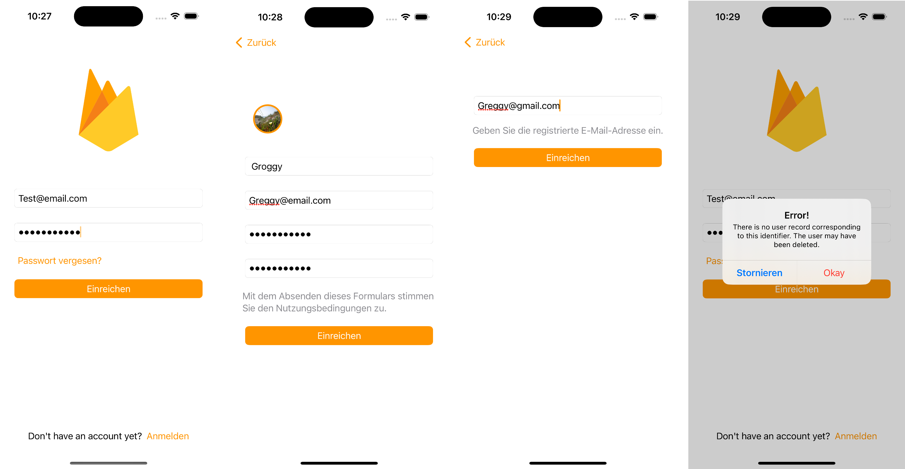
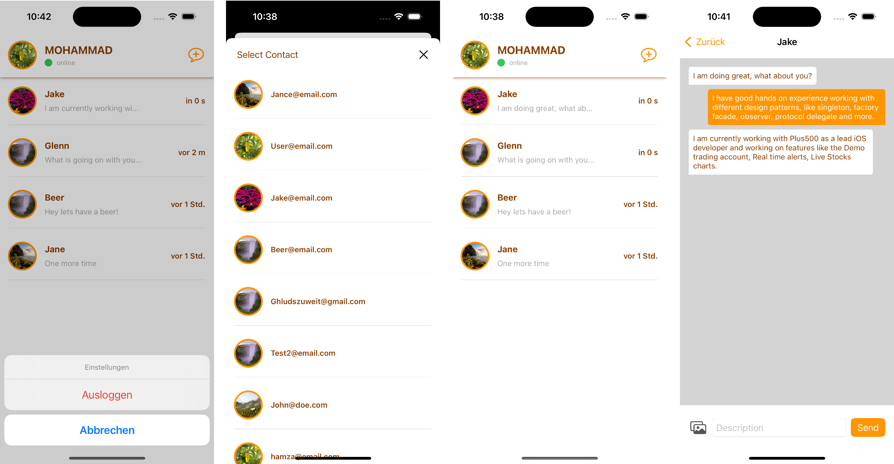

# Firechat
Firechat is a core chat application the enables user to send messages.
This app is build to demonstrate the power of SwiftUI and Firebase.
This project is opensource and can be used in any way possible.
Feel free to clone, reuse and improve codebase.

## Features
- User can register for an account using their email address.
- User can login and logout when registered.
- User will be able to reset password if forgotten.
- User be able to send text and image messages.
- User will have list of recently messaged users.
- User will be able to delete their account.
- Error handling alerts.

## Technology
- SwiftUI
- Firebase Auth
- Firebase Storage
- Firebase Firestore
- Firebase Analytics
- Firebase Crashlytics
- Quick and Nible tests

## Architecture
This project is build with MVVM-C and follows the Clean Architecture design.
It is also build around Protocol Oriented Programming.

## Screenshots

